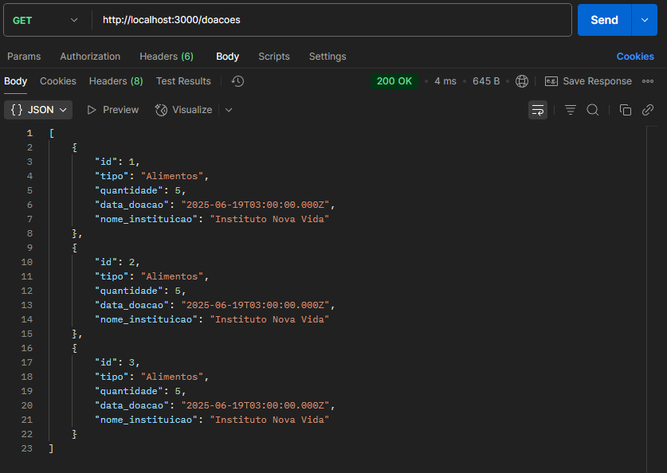

# ConectDoa (Node.js)

## Estrutura do Projeto

- `frontend/`: Código HTML, CSS e JS do site
- `backend/`: API em Node.js (você criará com minha ajuda)
- `database/`: Script SQL para criar o banco de dados
- `docs/`: Documentação original do projeto

<br>

# 📌 ConectDoa – Etapa 1: Banco de Dados

Este é o início do projeto **ConectDoa**, focado na criação do banco de dados MySQL.  
Aqui foi estruturado o banco que armazenará as informações sobre:

- Instituições
- Doações
- Usuários


## 🧱 Estrutura do Banco de Dados

As tabelas foram criadas no **MySQL Workbench**, com os seguintes comandos SQL:

```sql
    CREATE TABLE instituicao (
    id INT AUTO_INCREMENT PRIMARY KEY,
    nome VARCHAR(100),
    endereco VARCHAR(150),
    telefone VARCHAR(20),
    email VARCHAR(100)
    );

    CREATE TABLE doacao (
    id INT AUTO_INCREMENT PRIMARY KEY,
    id_instituicao INT,
    tipo VARCHAR(50),
    quantidade INT,
    data_doacao DATE,
    FOREIGN KEY (id_instituicao) REFERENCES instituicao(id)
    );

    CREATE TABLE usuario (
    id INT AUTO_INCREMENT PRIMARY KEY,
    nome VARCHAR(100),
    email VARCHAR(100),
    senha VARCHAR(100)
    );
```

## 🧪 Testes Realizados

- Inserção de dados com `INSERT INTO`
- Consulta com `SELECT * FROM`
- Verificação de tabelas com `SHOW TABLES;`
- Estrutura das tabelas com `DESCRIBE nome_da_tabela;`

## ✅ Resultado
- Banco de dados funcionando com sucesso.
- As tabelas estão relacionadas corretamente, com testes confirmando inserção e leitura dos dados.

<br>


# 📌 ConectDoa – Etapa 2: Início do Back-End

Nesta etapa, iniciamos o desenvolvimento do back-end da aplicação utilizando **Node.js** com o framework **Express**.


## 🧰 Tecnologias Utilizadas

- **Node.js** – Ambiente para executar JavaScript fora do navegador
- **Express** – Framework web para Node.js
- **MySQL2** – Biblioteca para conectar com o MySQL
- **Cors** – Middleware para permitir conexões externas (como do front-end)
- **Postman** – Ferramenta para testar rotas da API


## 📁 Estrutura Inicial de Pastas

backend/ <br>
├── index.js <br>
├── database/ <br>
│ └── connection.js <br>


## 🔌 Conexão com o Banco

Criamos o arquivo `database/connection.js`, responsável por se conectar com o banco de dados:

```js
    const mysql = require('mysql2');

    const connection = mysql.createConnection({
    host: 'localhost',
    user: 'SEU_USUARIO',
    password: 'SUA_SENHA',
    database: 'conectdoa'
    });

    connection.connect((err) => {
    if (err) {
        console.error('Erro ao conectar:', err);
        return;
    }
    console.log('Conectado ao banco!');
    });

    module.exports = connection;

```

## 🧠 O que significa:
- `require('mysql2')` importa a biblioteca MySQL2.
- `mysql.createConnection({...})` cria uma conexão com o banco.
- `connection.connect(...)` tenta se conectar ao banco e exibe se foi bem-sucedido.
- `module.exports` = connection exporta a conexão para que possa ser usada em outros arquivos.


## 🚀 Servidor Inicial
Criamos o arquivo index.js, que inicializa o servidor:

```js

    const express = require('express');
    const cors = require('cors');
    const app = express();

    app.use(cors());
    app.use(express.json());

    app.listen(3000, () => {
    console.log('Servidor rodando na porta 3000');
    });

```

## 🧠 O que isso faz:
- `express()` cria um app Express.
- `app.use(cors())` permite requisições externas (como do front-end).
- `app.use(express.json())` permite que o servidor receba dados em JSON.
- `app.listen(3000)` inicia o servidor na porta 3000.

<br>


# 📌 ConectDoa – Etapa 3: Rotas de Instituições

Nesta etapa, criamos as primeiras rotas usando o **Express** para interagir com a tabela `instituicao`.  
Essas rotas permitem **listar todas as instituições** e **cadastrar uma nova instituição**.


## 📁 Estrutura Atualizada

backend/ <br>
├── index.js <br>
├── database/ <br>
│ └── connection.js <br>
└── routes/ <br>
│ └── instituicoes.js <br>


## 📂 Arquivo: routes/instituicoes.js

```js
    const express = require('express');
    const router = express.Router();
    const db = require('../database/connection');

    // Rota para listar instituições
    router.get('/', (req, res) => {
    const sql = 'SELECT * FROM instituicao';
    db.query(sql, (err, results) => {
        if (err) return res.status(500).json({ error: 'Erro ao buscar instituições' });
        res.json(results);
    });
    });

    // Rota para cadastrar instituição
    router.post('/', (req, res) => {
    const { nome, endereco, telefone, email } = req.body;
    const sql = 'INSERT INTO instituicao (nome, endereco, telefone, email) VALUES (?, ?, ?, ?)';
    db.query(sql, [nome, endereco, telefone, email], (err, result) => {
        if (err) return res.status(500).json({ error: 'Erro ao cadastrar' });
        res.status(201).json({ message: 'Instituição cadastrada com sucesso!' });
    });
    });

    module.exports = router;
```

## 🧠 O que está acontecendo aqui:
- `express.Router()` cria um mini-app com rotas separadas.
- `router.get('/')` pega todas as instituições.
- `router.post('/')` insere uma nova instituição no banco.
- `db.query(...)` executa comandos SQL com o banco de dados.

## 🔗 Ligando essa rota ao servidor (index.js)

No seu arquivo index.js, adicione:
```js
    const instituicoesRoutes = require('./routes/instituicoes');
    app.use('/instituicoes', instituicoesRoutes);
```
Com isso, ao acessar /instituicoes no navegador ou Postman, a API saberá qual código executar.

## ✅ Testes com o Postman
`GET http://localhost:3000/instituicoes` → lista todas as instituições

`POST http://localhost:3000/instituicoes` com body JSON:

```json
    {
        "nome": "Instituto Esperança",
        "endereco": "Rua Exemplo, 123",
        "telefone": "11999999999",
        "email": "contato@esperanca.org"
    }
```

<br>


# 📌 ConectDoa – Etapa 4: Rotas de Doações

Nesta etapa, foram criadas rotas para **listar todas as doações** e **cadastrar uma nova doação**.  
As doações estão ligadas a uma instituição, e por isso usamos um **JOIN** para trazer informações combinadas.


## 📁 Estrutura Atualizada

backend/ <br>
├── index.js <br>
├── database/ <br>
│ └── connection.js <br>
├── routes/ <br>
│ └── instituicoes.js <br>
│ └── doacoes.js <Br>


## 📂 Arquivo: routes/doacoes.js

```js
    const express = require('express');
    const router = express.Router();
    const db = require('../database/connection');

    // Rota para listar todas as doações
    router.get('/', (req, res) => {
    const sql = `
        SELECT d.id, d.tipo, d.quantidade, d.data_doacao, i.nome AS nome_instituicao
        FROM doacao d
        JOIN instituicao i ON d.id_instituicao = i.id
    `;
    db.query(sql, (err, results) => {
        if (err) return res.status(500).json({ error: 'Erro ao buscar doações' });
        res.json(results);
    });
    });

    // Rota para cadastrar uma nova doação
    router.post('/', (req, res) => {
    const { id_instituicao, tipo, quantidade, data_doacao } = req.body;
    const sql = 'INSERT INTO doacao (id_instituicao, tipo, quantidade, data_doacao) VALUES (?, ?, ?, ?)';
    db.query(sql, [id_instituicao, tipo, quantidade, data_doacao], (err, result) => {
        if (err) return res.status(500).json({ error: 'Erro ao cadastrar doação' });
        res.status(201).json({ message: 'Doação registrada com sucesso!' });
    });
    });

    module.exports = router;
```

## 🧠 O que está acontecendo aqui:

- `router.get('/')`: Busca todas as doações.
- Usa um `JOIN` entre as tabelas doacao e instituicao para mostrar o nome da instituição junto.
- `router.post('/')`: Cadastra uma nova doação no banco com base no corpo da requisição.
- `db.query(...)`: Executa comandos SQL.

## 🔗 Ligando essa rota ao servidor (index.js)
No arquivo index.js, adicione:
```js
    const doacoesRoutes = require('./routes/doacoes');
    app.use('/doacoes', doacoesRoutes);
```

## ✅ Testes com o Postman
### 🔹 GET /doacoes
Retorna uma lista de doações com o nome da instituição.


### 🔹 POST /doacoes
Body JSON de exemplo:
```json
    {
        "id_instituicao": 1,
        "tipo": "Alimentos",
        "quantidade": 5,
        "data_doacao": "2025-06-19"
    }
```


<br>


# 📌 ConectDoa – Etapa 5: Cadastro e Login de Usuários

Nesta etapa, foram criadas rotas para:

- 📥 Cadastrar usuários
- 🔐 Realizar login (de forma simples, sem autenticação avançada ainda)

Essas rotas utilizam a tabela `usuario`, criada anteriormente no banco de dados.


## 📁 Estrutura Atualizada

backend/
├── index.js <br>
├── database/ <br>
│ └── connection.js <br>
└── routes/ <br>
├── instituicoes.js <br>
├── doacoes.js <Br>
└── usuarios.js <Br>


## 📂 Arquivo: routes/usuarios.js

```js
    const express = require('express');
    const router = express.Router();
    const db = require('../database/connection');

    // Cadastro de novo usuário
    router.post('/cadastro', (req, res) => {
    const { nome, email, senha } = req.body;
    const sql = 'INSERT INTO usuario (nome, email, senha) VALUES (?, ?, ?)';
    db.query(sql, [nome, email, senha], (err, result) => {
        if (err) return res.status(500).json({ error: 'Erro ao cadastrar usuário' });
        res.status(201).json({ message: 'Usuário cadastrado com sucesso!' });
    });
    });

    // Login de usuário
    router.post('/login', (req, res) => {
    const { email, senha } = req.body;
    const sql = 'SELECT * FROM usuario WHERE email = ? AND senha = ?';
    db.query(sql, [email, senha], (err, results) => {
        if (err) return res.status(500).json({ error: 'Erro ao fazer login' });
        if (results.length > 0) {
        res.status(200).json({ message: 'Login realizado com sucesso!', usuario: results[0] });
        } else {
        res.status(401).json({ message: 'Email ou senha inválidos' });
        }
    });
    });

    module.exports = router;
```

## 🧠 O que está acontecendo aqui:
- `router.post('/cadastro')`: Insere um novo usuário no banco.
- `router.post('/login')`: Verifica se o email e senha existem no banco e retorna os dados do usuário.
- **Atenção**: Senhas estão sendo armazenadas em texto puro (sem criptografia) – isso será melhorado futuramente.

## 🔗 Ligando essa rota ao servidor (index.js)
No arquivo index.js, adicione:
```js
    const usuariosRoutes = require('./routes/usuarios');
    app.use('/usuarios', usuariosRoutes);
```
## ✅ Testes com o Postman
### 🔹 POST `/usuarios/cadastro`
Body JSON de exemplo:

```json
    {
        "nome": "João Silva",
        "email": "joao@email.com",
        "senha": "123456"
    }
```
### 🔹 POST `/usuarios/login`
```json
    {
        "email": "joao@email.com",
        "senha": "123456"
    }
```