## 4. Projeto da Solução
Pré-requisitos: <a href="3-Especificação.md"> Especificação do Projeto (Requisitos do Software) </a>

## 4.1. Arquitetura da solução
A seguir, apresentamos o diagrama de arquitetura da solução desenvolvida para a plataforma, que visa oferecer uma experiência interativa e personalizada para diferentes usuários, com controle de acesso a páginas distintas.

Tecnologias Utilizadas
Frontend: HTML5, CSS3 e JavaScript

Backend / Servidor: Node.js

Banco de Dados: MySQL

 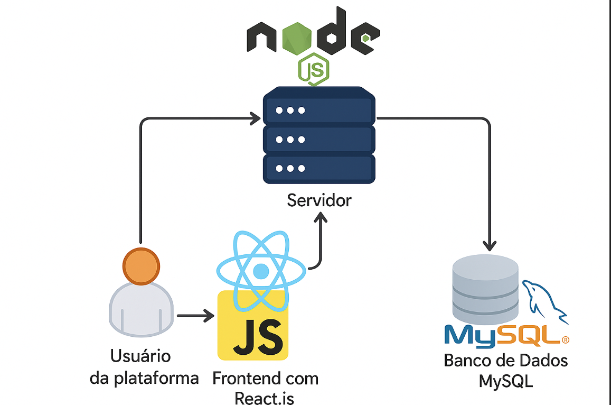
  
Descrição dos Módulos
Usuário da Plataforma: O usuário acessa a plataforma por meio de um navegador web. Pode se tratar de usuários distintos (ex: João e Maria), com acessos diferenciados com base em credenciais.

Frontend (HTML, CSS, JavaScript): A camada de interface que lida com a interação do usuário. Aqui, o JavaScript realiza a validação e redirecionamento conforme o tipo de usuário. A interface é responsiva e visualmente amigável, desenvolvida com CSS customizado e animado.

Servidor (Node.js): Responsável por processar requisições, validar credenciais, armazenar e recuperar dados. Aqui é onde seria implementado um controle de sessão/autenticação real para segurança.

Banco de Dados (MySQL): Armazena os dados dos usuários, permissões, páginas associadas e outras informações necessárias para o funcionamento da aplicação.

 
## 4.2. Wireframes/Mockups de telas

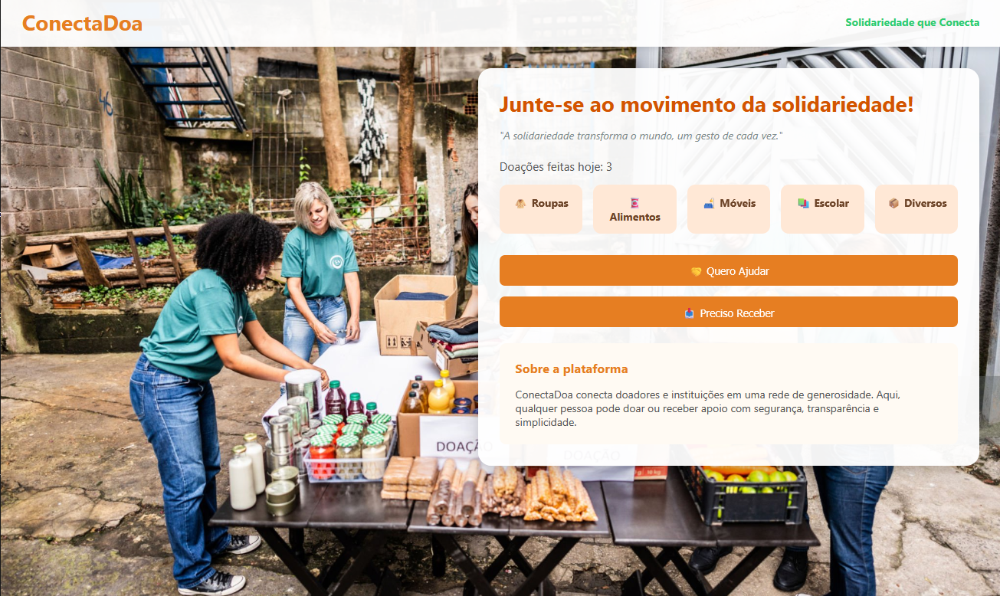
Funcionalidades da Página:

1. Visualização de Categorias de Doação
Exibe categorias de doação como Roupas, Alimentos, Móveis, Escolar e Diversos. O usuário pode navegar e escolher uma categoria para ver os itens disponíveis.
3. Contador de Doações Realizadas
Mostra o número de doações feitas no dia, como "Doações feitas hoje: 3", incentivando mais doações.
4. Ação - Quero Ajudar
Botão que direciona para o cadastro de doador (CPF ou CNPJ). Objetivo: permitir que o usuário se cadastre para fazer doações.
6. Ação - Preciso Receber
Botão que direciona para o cadastro de receptor (CPF ou CNPJ). Objetivo: permitir que o usuário se cadastre para receber doações.
8. Informações Sobre a Plataforma
Texto explicativo sobre o ConectDoa, destacando como a plataforma conecta doadores e instituições de maneira segura e transparente.

 Tela de cadastro de usuário O usuário irá fornecer informações pessoais para fazer um cadastro para conseguir acessar as funcionalidades do Sistema.

 Cadastro das empresas parceiras ,O sócio administrador irá fornecer informações da empresa,mas a mesma passará por uma  breve investigação se for aprovada a solicitação receberá por email o nome de usuário e senha para poder acessar o sistema.

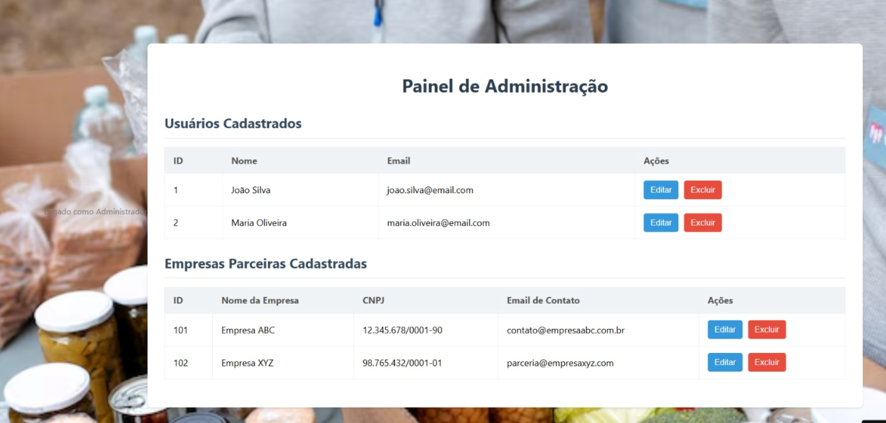

 Tela administrador Essa tela somente o administrador do sistema terá acesso pois pode ser adicionado usuário e adicionar empresas .

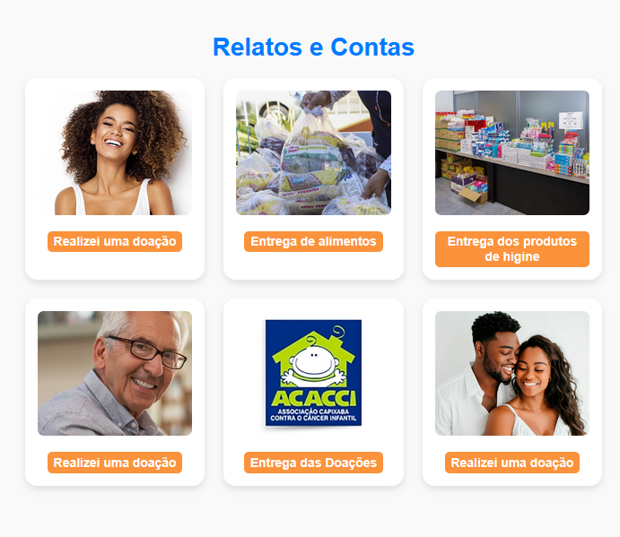

 Essa tela tem como objetivo mostrar os relatos dos doadores que encontraram instituições através do Conecta Doa. 
 E mostrar a prestação de contas das instituições. Ou seja, as instituições mostram as ações de entrega das doações arrecadadas.

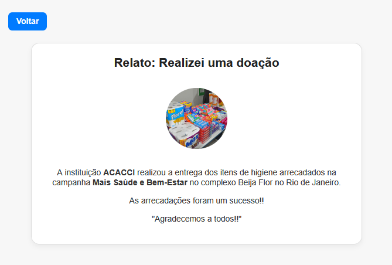

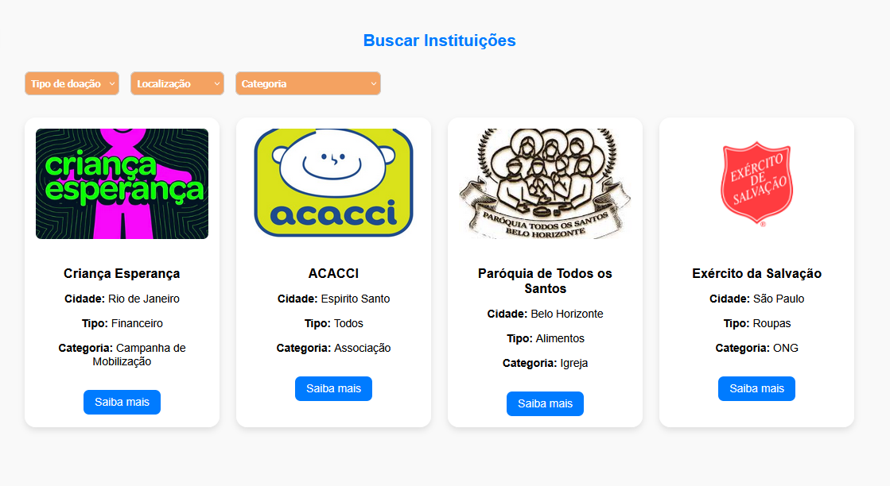

 Essa tela tem como objetivo mostrar as instituições cadastradas. 
 Nela podemos filtrar por localização (cidade), tipo de doação que recebe e por tipo de instituição (associação, ONG...) 
 Ao filtrar e selecionar a instituição de interre, irá abrir uma tela, falando sobre essa instituição e o link, que direcionará o doador ao site e meio de comunicação oficial do local. 
 O usuário pode selecionar o botão de Voltar e voltar a procurar pela instituição dr interesse

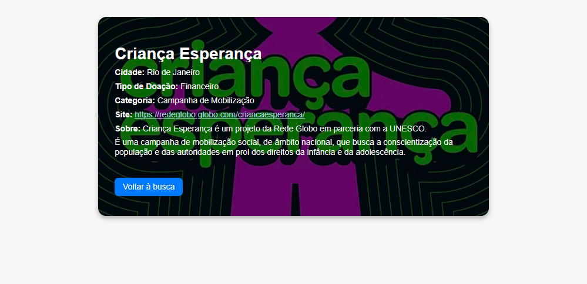

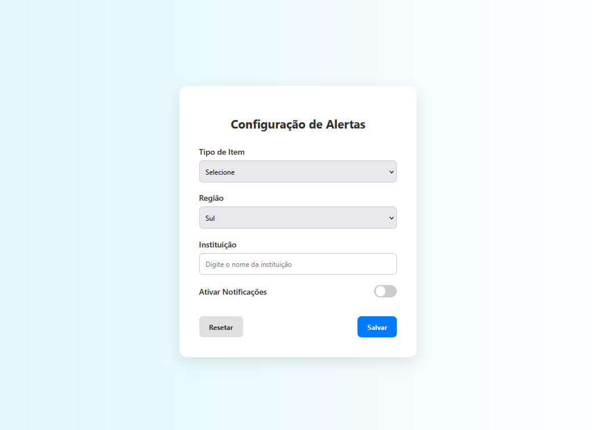

Tem como objetivo identificar o Tipo de idem doado, a Região e Instituição que se encontra.
Também apresenta 1 botão para ativar as notificações, 1 para resetar e 1 para salvar.

São protótipos usados em design de interface para sugerir a estrutura de um site web e seu relacionamentos entre suas páginas. Um wireframe web é uma ilustração semelhante do layout de elementos fundamentais na interface.
 

## Modelo Entidade-Relacionamento (DER)

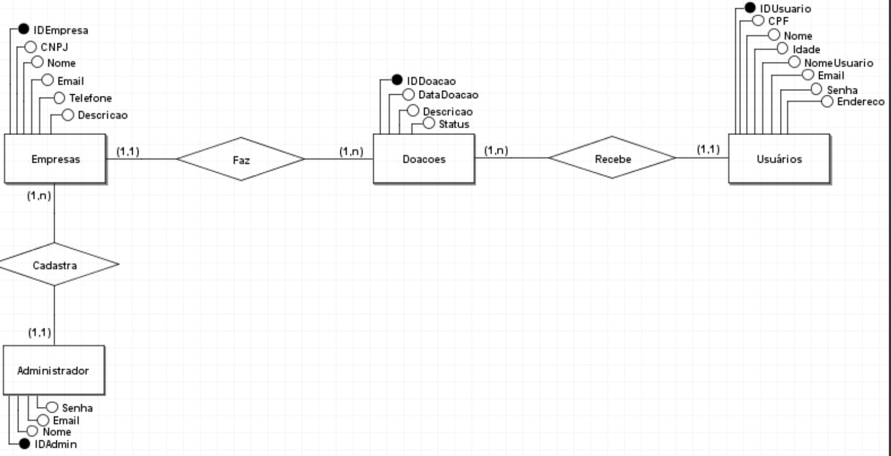

## 4.3. Modelo de dados

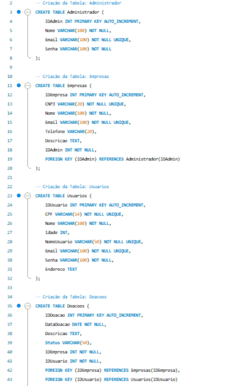

O desenvolvimento da solução proposta requer a existência de bases de dados que permitam efetuar os cadastros de dados e controles associados aos processos identificados, assim como recuperações.
Utilizando a notação do DER (Diagrama Entidade e Relacionamento), elaborem um modelo, na ferramenta visual indicada na disciplina, que contemple todas as entidades e atributos associados às atividades dos processos identificados. Deve ser gerado um único DER que suporte todos os processos escolhidos, visando, assim, uma base de dados integrada. O modelo deve contemplar, também, o controle de acesso de usuários (partes interessadas dos processos) de acordo com os papéis definidos nos modelos do processo de negócio.
_Apresente o modelo de dados por meio de um modelo relacional que contemple todos os conceitos e atributos apresentados na modelagem dos processos._

## 4.3.1 Esquema Relacional

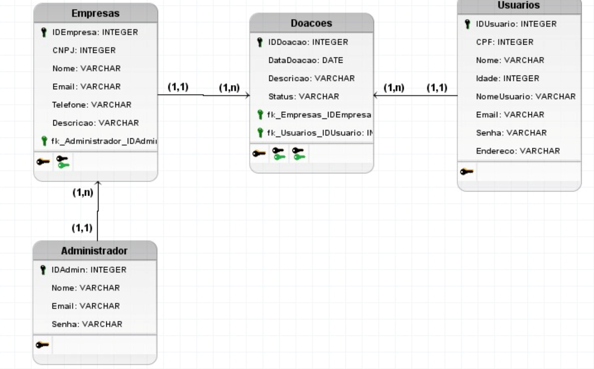

## 4.3.2 Modelo Físico

<code>
 create schema ConectDoa;
use ConectDoa;

CREATE TABLE Empresas (
    IDEmpresa INTEGER PRIMARY KEY,
    CNPJ INTEGER,
    Nome VARCHAR (150),
    Email VARCHAR (150),
    Telefone VARCHAR (150),
    Descricao VARCHAR (255),
    fk_Administrador_IDAdmin INTEGER
);

CREATE TABLE Usuarios (
    IDUsuario INTEGER PRIMARY KEY,
    CPF INTEGER,
    Nome VARCHAR (150),
    Idade INTEGER,
    NomeUsuario VARCHAR (150),
    Email VARCHAR (150),
    Senha VARCHAR (150),
    Endereco VARCHAR (150)
);

CREATE TABLE Doacoes (
    IDDoacao INTEGER PRIMARY KEY,
    DataDoacao DATE,
    Descricao VARCHAR (255),
    Status VARCHAR (50),
    fk_Empresas_IDEmpresa INTEGER,
    fk_Usuarios_IDUsuario INTEGER
);

CREATE TABLE Administrador (
    IDAdmin INTEGER PRIMARY KEY,
    Nome VARCHAR (150),
    Email VARCHAR (150),
    Senha VARCHAR (150)
);
 
ALTER TABLE Empresas ADD CONSTRAINT FK_Empresas_2
    FOREIGN KEY (fk_Administrador_IDAdmin)
    REFERENCES Administrador (IDAdmin)
    ON DELETE RESTRICT;
 
ALTER TABLE Doacoes ADD CONSTRAINT FK_Doacoes_2
    FOREIGN KEY (fk_Empresas_IDEmpresa)
    REFERENCES Empresas (IDEmpresa)
    ON DELETE RESTRICT;
 
ALTER TABLE Doacoes ADD CONSTRAINT FK_Doacoes_3
    FOREIGN KEY (fk_Usuarios_IDUsuario)
    REFERENCES Usuarios (IDUsuario)
    ON DELETE RESTRICT;

 </code>

### 4.3. Tecnologias

Banco de Dados (SGBD)
MySQL
Utilizado para armazenar e gerenciar os dados da aplicação, como informações de usuários, registros de atividades, histórico, etc. É um sistema de gerenciamento de banco de dados relacional (SGBDR) confiável e amplamente utilizado.

Front-End
HTML (HyperText Markup Language)
Responsável pela estrutura das páginas da aplicação, definindo elementos como cabeçalhos, parágrafos, botões, formulários, entre outros.

CSS (Cascading Style Sheets)
Utilizado para a estilização da interface, controlando cores, tamanhos, espaçamentos, posicionamentos e responsividade da aplicação.

JavaScript (JS)
Linguagem de programação utilizada para adicionar interatividade no front-end, como validação de formulários, chamadas assíncronas (AJAX/fetch) e manipulação do DOM.

Deploy e Versionamento
Git e GitHub
Para controle de versão do código-fonte e colaboração entre desenvolvedores, mantendo um histórico organizado do projeto.

IDE e Ferramentas de Desenvolvimento
Visual Studio Code
Utilizado para o desenvolvimento do front-end com suporte a HTML, CSS e JavaScript.

Apresente também uma figura explicando como as tecnologias estão relacionadas ou como uma interação do usuário com o sistema vai ser conduzida, por onde ela passa até retornar uma resposta ao usuário.

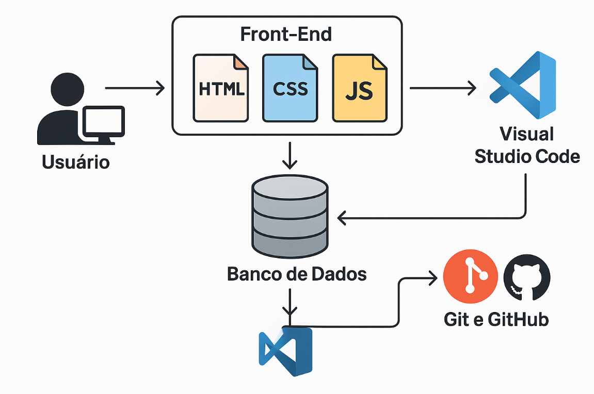

| **Dimensão**   | **Tecnologia**  |
| ---            | ---             |
| SGBD           | MySQL           |
| Front end      | HTML+CSS+JS     |
| Back end       | Node.js |
| Deploy         | Github Pages    |

