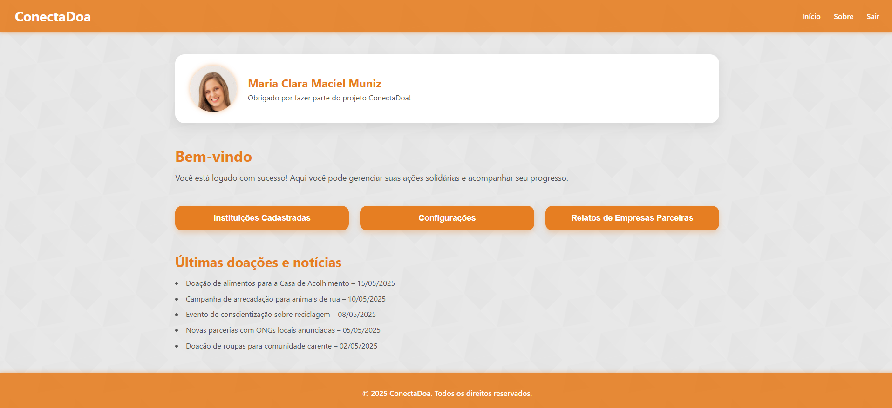
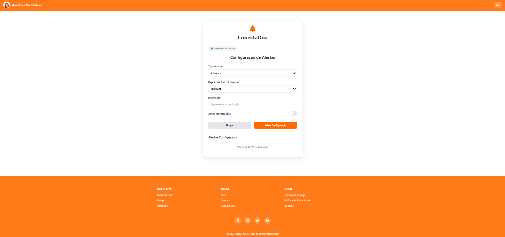

# 5. Interface do Sistema

Pré-requisitos: <a href="4-Projeto-Solucao.md"> Projeto da Solução</a>

_Visão geral da interação do usuário por meio das telas do sistema. Apresente as principais interfaces da plataforma._

## 5.1. Tela principal do sistema

_Descrição da tela principal do sistema._

[`Tela principal do sistema`](./images/TELAPRINCIPAL.png)

## 5.2. Telas do processo 1

_Descrição da tela relativa à atividade 1._

[`Tela de Login `](./images/TELADELOGIN.png)

[`Tela para criar conta`](./images/TELACRIARCONTA.png)

_Descrição da tela relativa à atividade 2._

[`Tela de Perfil do usuario`](./images/TELAPERFIL.png)

## 5.3. Telas do processo 2

_Descrição da tela relativa à atividade 1._

[`Tela de instituições cadastradas`](./images/INSTITUICAOCADASTRADA.png)

[`Tela de configurações`](./images/TELACONFIGURACAO.png)

[`Tela de Relatos`](./images/TELARELATOS.png)

