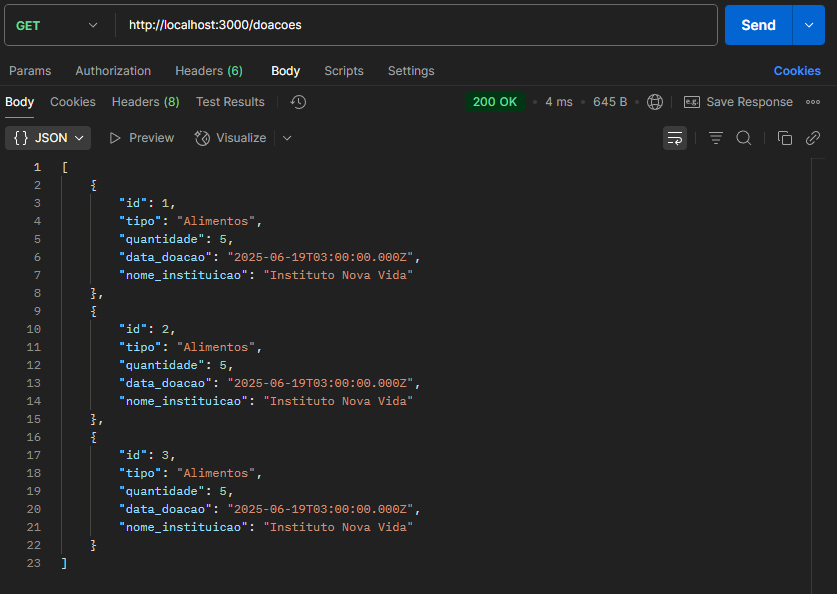

# 📌 ConectDoa – Etapa 4: Rotas de Doações

Nesta etapa, foram criadas rotas para **listar todas as doações** e **cadastrar uma nova doação**.  
As doações estão ligadas a uma instituição, e por isso usamos um **JOIN** para trazer informações combinadas.

---

## 📁 Estrutura Atualizada

backend/ <br>
├── index.js <br>
├── database/ <br>
│ └── connection.js <br>
├── routes/ <br>
│ └── instituicoes.js <br>
│ └── doacoes.js <Br>


## 📂 Arquivo: routes/doacoes.js

```js
    const express = require('express');
    const router = express.Router();
    const db = require('../database/connection');

    // Rota para listar todas as doações
    router.get('/', (req, res) => {
    const sql = `
        SELECT d.id, d.tipo, d.quantidade, d.data_doacao, i.nome AS nome_instituicao
        FROM doacao d
        JOIN instituicao i ON d.id_instituicao = i.id
    `;
    db.query(sql, (err, results) => {
        if (err) return res.status(500).json({ error: 'Erro ao buscar doações' });
        res.json(results);
    });
    });

    // Rota para cadastrar uma nova doação
    router.post('/', (req, res) => {
    const { id_instituicao, tipo, quantidade, data_doacao } = req.body;
    const sql = 'INSERT INTO doacao (id_instituicao, tipo, quantidade, data_doacao) VALUES (?, ?, ?, ?)';
    db.query(sql, [id_instituicao, tipo, quantidade, data_doacao], (err, result) => {
        if (err) return res.status(500).json({ error: 'Erro ao cadastrar doação' });
        res.status(201).json({ message: 'Doação registrada com sucesso!' });
    });
    });

    module.exports = router;
```

## 🧠 O que está acontecendo aqui:

- `router.get('/')`: Busca todas as doações.
- Usa um `JOIN` entre as tabelas doacao e instituicao para mostrar o nome da instituição junto.
- `router.post('/')`: Cadastra uma nova doação no banco com base no corpo da requisição.
- `db.query(...)`: Executa comandos SQL.

## 🔗 Ligando essa rota ao servidor (index.js)
No arquivo index.js, adicione:
```js
    const doacoesRoutes = require('./routes/doacoes');
    app.use('/doacoes', doacoesRoutes);
```

## ✅ Testes com o Postman
### 🔹 GET /doacoes
Retorna uma lista de doações com o nome da instituição.


### 🔹 POST /doacoes
Body JSON de exemplo:
```json
    {
        "id_instituicao": 1,
        "tipo": "Alimentos",
        "quantidade": 5,
        "data_doacao": "2025-06-19"
    }
```
